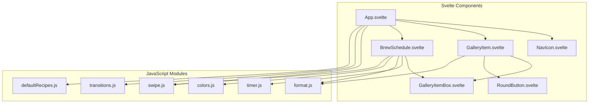

# Svelte Tea Timer Project Overview

This document provides a high-level overview of the Svelte Tea Timer application's structure and components.

## Summary

This is a single-page application built with Svelte and bundled using Rollup. It allows users to time the brewing of different types of tea based on predefined or imported recipes.

-   **Entry Point**: `src/main.js` initializes the Svelte app.
-   **Root Component**: `src/App.svelte` is the main component that manages the application state, including the list of tea recipes and the currently selected recipe. It handles switching between the recipe gallery view and the brew timer view.
-   **State Management**: The application state, such as tea recipes and the current recipe, is stored in the browser's `localStorage`.
-   **Core Components**:
    -   `BrewSchedule.svelte`: Displays the timer interface for a selected tea recipe, handles the timer logic, and sends notifications.
    -   `GalleryItem.svelte`: Displays a single tea recipe in the gallery view.
    -   `NavIcon.svelte`, `RoundButton.svelte`, `GalleryItemBox.svelte`: Are smaller, reusable UI components.
-   **Helper Modules**: The application uses several plain JavaScript modules in `src/` for specific functionalities:
    -   `timer.js`: Core timer logic.
    -   `format.js`: Time formatting utilities.
    -   `colors.js`: Color manipulation functions.
    -   `swipe.js`: Touch gesture handling.
    -   `transitions.js`: Svelte transitions.
    -   `defaultRecipes.js`: Provides the initial set of tea recipes.

## Component & Module Relationship Diagram

